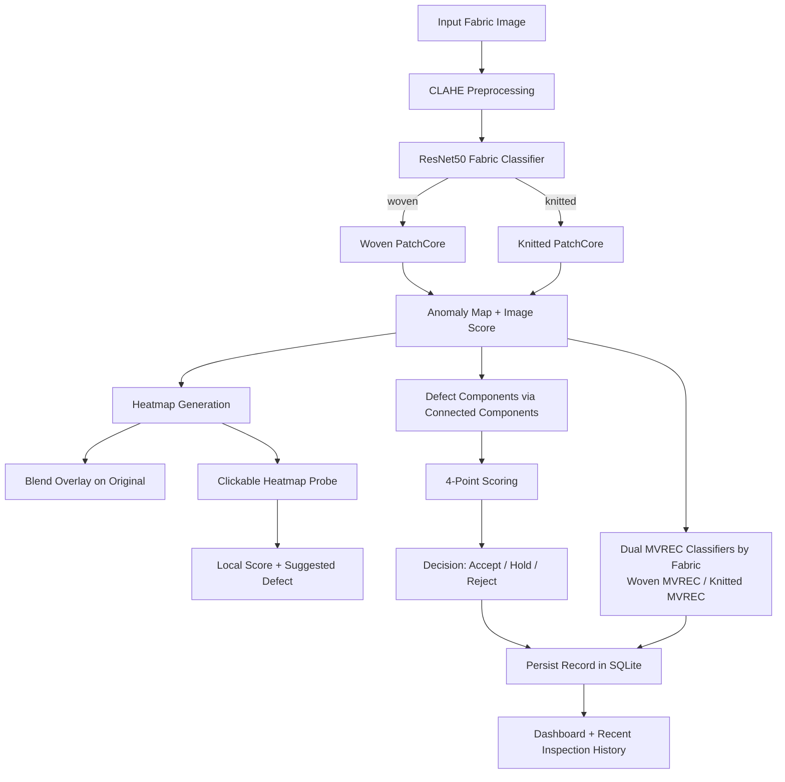
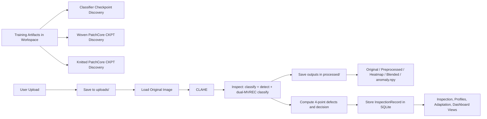
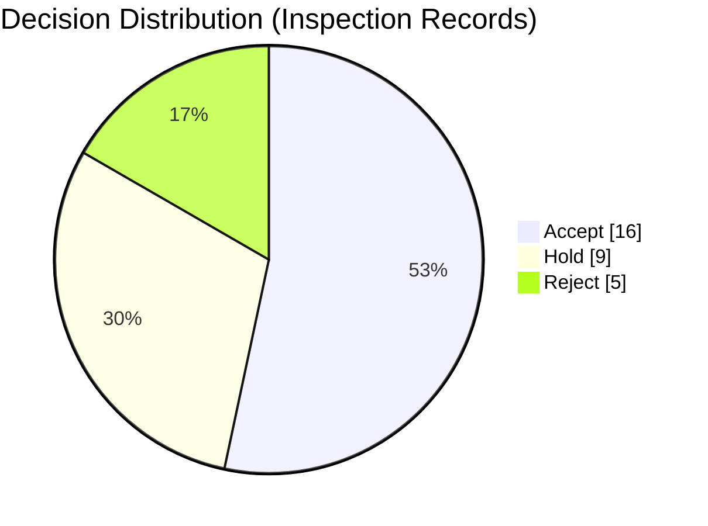

# Fabric Fault Detection and Inspection Prototype

## Title + Authors/Affiliation

**Project Title:** Fabric Fault Detection and Inspection Prototype: Hybrid ResNet50 + PatchCore + MVREC-Ready Pipeline

**Authors:**
- Your Name
- Collaborator Name

**Affiliation:**
- Your Lab / Department / Company

**Date:** 2026-04-17

---

## Problem Statement + Motivation (with example images)

Industrial textile inspection still faces three common bottlenecks:
1. Manual inspection is inconsistent under fatigue, illumination variation, and high roll speed.
2. Defect appearance changes across fabric families (woven vs knitted), making single-threshold logic brittle.
3. Production teams need both localization (where is the defect?) and decision support (accept, hold, reject), not only a binary defect flag.

This project builds a practical, deployable prototype that combines:
- Fabric type routing (woven/knitted)
- One-class anomaly localization
- Dual MVREC defect-type classification (woven MVREC + knitted MVREC, few-shot ready)
- Defect grading support via 4-point scoring
- Operator-friendly visual inspection UI

### Example Images from Current Workspace

| Example Input | Example Input |
|---|---|
|  |  |

| UI Snapshot (Auto Ratio mode) | UI Snapshot (Manual Area mode) |
|---|---|
|  |  |

### Real Live App Snapshots (captured by running the app)

| Live inspection page | Live inspection result |
|---|---|
|  |  |

| Live dashboard |
|---|
|  |

---

## Objectives / Contributions

1. Build an end-to-end inspection web prototype with image upload, preprocessing, anomaly localization, and decision output.
2. Use a dual-stage model strategy:
   - Fabric classifier (ResNet50) for routing.
   - Fabric-specific PatchCore anomaly detector for localization.
3. Use two separate MVREC classifiers (few-shot ready), one per fabric family:
   - MVREC-Woven
   - MVREC-Knitted
4. Provide operator-centric visualization:
   - Original and CLAHE-preprocessed image
   - Heatmap
   - Blend-on-original toggle with adjustable alpha
   - Clickable heatmap probe for local anomaly score and defect suggestion
5. Implement quality scoring support through connected-component based 4-point scoring and Accept/Hold/Reject decision.
6. Add production-oriented management views:
   - Few-shot adaptation run logging
   - Fabric profile library
   - Dashboard with inspection statistics
7. Keep packaging path practical via CPU and CUDA build scripts with PyInstaller.

---

## Literature Review (brief, with key citations)

This prototype is informed by a blend of anomaly detection and few-shot learning literature.

1. **PatchCore** introduced memory-bank nearest-neighbor anomaly scoring with coreset subsampling, showing strong industrial AD performance and high MVTec AD image-level AUROC (Roth et al., CVPR 2022).
2. **Anomalib** provides a practical framework to train and deploy multiple AD methods, including PatchCore, with consistent data/model/evaluation pipelines.
3. **CLIP and AlphaCLIP** motivate mask-aware region-context representations for localized semantics. AlphaCLIP is relevant when anomaly maps or masks can guide region-focused defect classification.
4. **Few-shot foundations** (Matching Networks, Prototypical Networks, MAML) motivate 1/3/5-shot adaptation workflows when new defect categories emerge.
5. **MVREC context** supports multi-view region-context few-shot defect classification, aligning with this project's roadmap for robust low-shot defect typing.

Key practical insight for this project: anomaly localization and defect taxonomy expansion are complementary. PatchCore addresses unknown anomaly discovery, while MVREC-style few-shot adaptation supports known defect class refinement.

---

## Proposed Method

The method follows a routed inspection architecture with model specialization by fabric type.

### Why this architecture

1. Fabric-specific routing reduces cross-texture confusion.
2. Patch-level anomaly maps preserve localization detail needed by inspectors.
3. UI interactivity (blend + probe) turns model output into actionable signals.
4. Database logging enables traceability, trend review, and operations feedback loops.

---

## Data Pipeline / Workflow

This pipeline includes both asset preparation and runtime inference.

---

## Implementation Details

### Stack

- Backend: Flask with Blueprints
- Frontend: Jinja2 templates, Tailwind CSS, Alpine.js
- Database: SQLite via Flask-SQLAlchemy
- Image processing: OpenCV, NumPy
- ML runtime: PyTorch, torchvision, anomalib
- Packaging: PyInstaller (CPU and CUDA variants)

### Main Modules

- App bootstrap and configuration in `fabric-inspection-prototype/app/__init__.py` and `fabric-inspection-prototype/app/config.py`
- Core model manager and checkpoint loading in `fabric-inspection-prototype/app/ml_models.py`
- Preprocessing, heatmap blending, scoring utilities in `fabric-inspection-prototype/app/utils.py`
- Inspection route and APIs in `fabric-inspection-prototype/app/routes/main.py`
- Few-shot adaptation logging route in `fabric-inspection-prototype/app/routes/adapt.py`
- Profiles and dashboard routes in `fabric-inspection-prototype/app/routes/profiles.py`

### Runtime behavior highlights

1. CLAHE-only preprocessing is applied before inference.
2. Fabric classifier confidence fallback routes to heuristic woven/knitted guess when confidence is low.
3. PatchCore is loaded from local model folder or external workspace training artifacts.
4. Fallback anomaly map is used if PatchCore runtime/checkpoint inference fails.
5. Heatmap blending supports per-request alpha control through `/api/blend`.
6. Local heatmap probing is exposed through `/api/local-score`.

---

## Experiments / Setup

### Environment

1. Python virtual environment with separate CPU and CUDA requirements files.
2. Build scripts:
   - `fabric-inspection-prototype/build_cpu.bat`
   - `fabric-inspection-prototype/build_cuda.bat`
3. Run command: `python run.py` from `fabric-inspection-prototype`.

### Model setup used by prototype

- Fabric classifier: ResNet50 checkpoint loading from known paths.
- Anomaly detector: fabric-specific PatchCore Lightning checkpoints.
- Anomaly classifier: two separate MVREC classifiers (woven and knitted), both few-shot ready.

### Suggested benchmark protocol for reporting

1. Evaluate woven and knitted subsets separately.
2. Report image-level anomaly score quality and defect-region quality.
3. Report operational metrics:
   - Inference latency per image
   - Decision distribution (Accept/Hold/Reject)
   - Manual correction rate by operators

---

## Results (qualitative visuals + tables/charts)

### Model performance snapshot

| Model | Fabric | Metric | Value |
|---|---|---|---:|
| Fabric Classifier (ResNet50) | Woven + Knitted | Validation Accuracy | 1.0000 |
| Anomaly Detector (PatchCore) | Woven | Image AUROC | 0.9293751121 |
| Anomaly Detector (PatchCore) | Woven | Image F1 Score | 0.9785330892 |
| Anomaly Detector (PatchCore) | Knitted | Image AUROC | 0.9994972348 |
| Anomaly Detector (PatchCore) | Knitted | Image F1 Score | 0.9902279973 |

Woven and knitted detector values above were provided from your latest run outputs.

### Woven detector detailed metrics (latest)

| Metric | Value |
|---|---:|
| accuracy | 0.960461 |
| average_precision | 0.991618 |
| f1_defect | 0.978533 |
| f1_macro | 0.864267 |
| precision_defect | 0.968142 |
| recall_defect | 0.989150 |
| roc_auc | 0.929375 |

### Knitted detector detailed metrics (latest)

| Metric | Value |
|---|---:|
| accuracy | 0.985366 |
| average_precision | 0.999833 |
| f1_defect | 0.990228 |
| f1_macro | 0.980551 |
| precision_defect | 0.987013 |
| recall_defect | 0.993464 |
| roc_auc | 0.999497 |

### Qualitative visual outputs to show per sample

1. Original image
2. CLAHE image
3. Heatmap
4. Blended heatmap on original
5. Clicked local score popup evidence

### Example qualitative panel (input-side)

| Input A | Input B |
|---|---|
|  |  |

### Live output panel (captured during this run)

| Inspection result view | Dashboard view |
|---|---|
|  |  |

### Quantitative summary table (auto-filled from SQLite)

| Split / Fabric | Total Images | Avg Anomaly Score | Accept | Hold | Reject | Notes |
|---|---:|---:|---:|---:|---:|---|
| Woven | 11 | 0.9795 | 6 | 4 | 1 | From inspection_records |
| Knitted | 19 | 0.9111 | 10 | 5 | 4 | From inspection_records |
| Combined | 30 | 0.9362 | 16 | 9 | 5 | From inspection_records |

### Decision distribution chart (auto-filled)

Data source: SQLite table `inspection_records` in `fabric-inspection-prototype/fabric_inspection.db`.

---

## Ablation / Analysis

Recommended ablation matrix for this project:

1. **Preprocessing effect:** No preprocessing vs CLAHE-only.
2. **Detector effect:** PatchCore vs fallback anomaly map.
3. **Routing effect:** Single detector for all fabrics vs routed woven/knitted detectors.
4. **Threshold effect:** pixel threshold sweep for component extraction and 4-point outcomes.
5. **UI utility effect:** With blend+probe vs without blend+probe in operator review time.

Analysis focus:

- False positives on repetitive but normal texture patterns
- False negatives on low-contrast micro-defects
- Stability of local probe scores under varying blend alpha
- Decision drift across fabric profiles and threshold settings

---

## Conclusion + Future Work

This project already establishes a practical and inspectable pipeline that combines anomaly localization, operator-facing visualization, and decision support in a deployable Flask application.

Future work priorities:

1. Calibrate and benchmark the dual MVREC classifiers per fabric profile and shot setting.
2. Add calibrated threshold learning per fabric profile.
3. Add robust evaluation scripts for per-fabric AUROC, AUPRO, and decision-cost metrics.
4. Add uncertainty estimation and human-in-the-loop correction feedback storage.
5. Expand dashboard to include trend charts and batch-level quality KPIs.

---

## References

1. Roth, K., et al. (2022). Towards Total Recall in Industrial Anomaly Detection. CVPR. https://arxiv.org/abs/2106.08265
2. Bergmann, P., et al. (2019). MVTec AD: A Comprehensive Real-World Dataset for Unsupervised Anomaly Detection. https://www.mvtec.com/company/research/datasets/mvtec-ad
3. Anomalib Team. Anomalib repository and documentation. https://github.com/open-edge-platform/anomalib
4. Radford, A., et al. (2021). Learning Transferable Visual Models From Natural Language Supervision (CLIP). https://arxiv.org/abs/2103.00020
5. Sun, Z., et al. (2024). AlphaCLIP: A CLIP Model Focusing on Wherever You Want. CVPR. https://arxiv.org/abs/2312.03818
6. Vinyals, O., et al. (2016). Matching Networks for One Shot Learning. https://arxiv.org/abs/1606.04080
7. Snell, J., Swersky, K., and Zemel, R. (2017). Prototypical Networks for Few-shot Learning. https://arxiv.org/abs/1703.05175
8. Finn, C., Abbeel, P., and Levine, S. (2017). Model-Agnostic Meta-Learning for Fast Adaptation of Deep Networks. https://arxiv.org/abs/1703.03400
9. MVREC paper context: MVREC: A General Few-shot Defect Classification Model Using Multi-View Region-Context. arXiv:2412.16897
